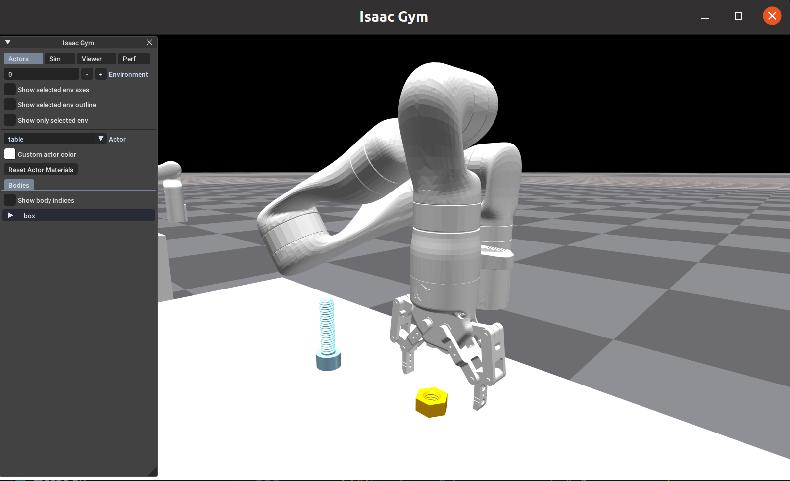
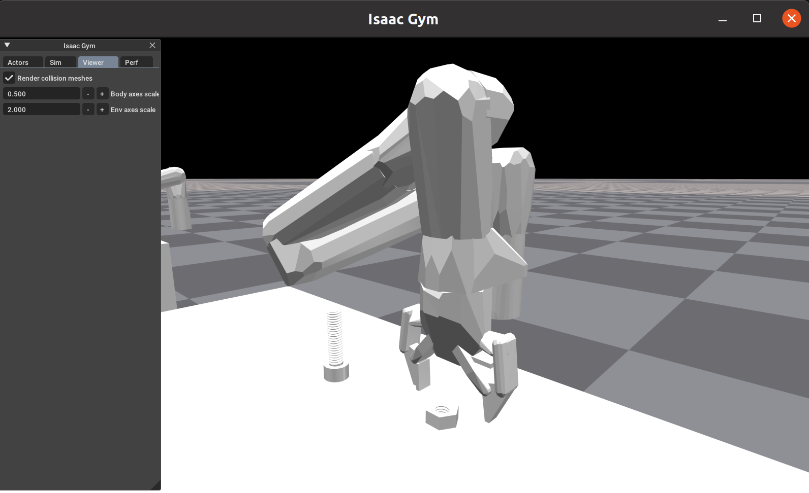
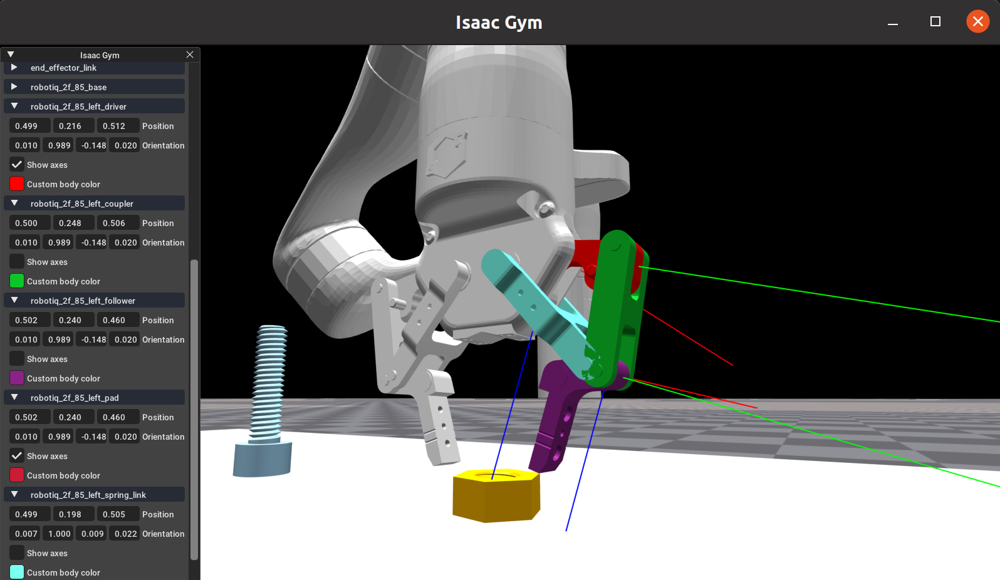

# isaacgym-kinova-gen3-plugin

A modified URDF file and python example script for Kinova Gen 3 robot with Franka Panda Gripper simulation using Isaac Gym.

# Demo (old)

# Installation

- Download [Isaac Gym](https://developer.nvidia.com/isaac-gym) `IsaacGym_Preview_4_Package.tar.gz` and install it;
- Move `kortex_description` to `isaacgym/assets`;
- Move `kinova_nut_bolt_ik_osc.py` to `isaacgym/python/examples`;
- Run `cd isaacgym/python/examples`, and then `python3 kinova_nut_bolt_ik_osc.py`.

# Known Issue

- gripper control have some problem;
- Null space control to be developed.

# Source

- URDF file: [Kortex Description](https://github.com/Kinovarobotics/ros_kortex/tree/noetic-devel/kortex_description)
- ros_kortex/kortex_description/arms/gen3/7dof/

# Gripper link reference

